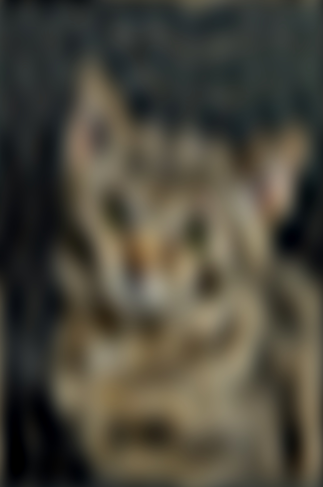

# Computer Vision Projects

This page covers some of my computer vision projects. The code for these projects is in a private repo which is available upon request.

## A) Compression and Filtering 
Compression is the way to reduce the size of an image by reducing information in the image by only selecting the frequencies which have a
higher contribution for a given image, based on a threshold value. Only the amplitudes (magnitude) greater than the threshold will be
retained in the complex plane.
With higher compression, the threshold is higher. This means only a handful of frequencies will be picked and a lot of information may be
lost. The image will loose most of the details. The dog images below show that.

   
  <em>Figure A1: Input image Dog</em>

    
  <em>Figure A2: Compressed image and FFT (lower threshold)</em>

    
  <em>Figure A3: Compressed image and FFT (higher threshold)</em>

Filtering is the way to filter out the frequency content of an image (Low pass or high pass) irrespective of the magnitude.
When filtering with a low pass, the high frequency content is filtered out which leads to ringing . Ringing is basically ripples appearing in
the image once high frequency noise is filtered out, which contain more information about the edges in an image. As seen in the cat example,
the more high frequency content we removed, the ringing becomes more and more prominent.

   
  <em>Figure A4: Input image Cat</em>

    
  <em>Figure A5: Filtered image and low pass filter</em>

    
  <em>Figure A6: Filtered image  and low pass filter</em>

## B) Lucas Kanade

Tracking image shift - More details coming soon 

    
  <em>Figure B1:Input image 0 shift and right shift 2 units</em>

   
  <em>Figure B2: Lucas Kanade optical flow

## C) Gaussian and Laplacian Pyramid

More content coming soon

   
  <em>Figure C1: Gaussian Pyramid

   
  <em>Figure C2: Laplacian Pyramid

## D) Object detection and Tracking - Particle filters

More content coming soon

     
  <em>Figure D1: Object detection and Tracking using particle filters

## E) Face Detection

More content coming soon

     
  <em>Figure E1: Average face and Eigen faces

## F) CNN Digit classification and Detection

Digit classification and detection - (https://drive.google.com/file/d/13VlsIiL7V8To27km389ZbwALut2mUxDG/view?usp=drive_link)

