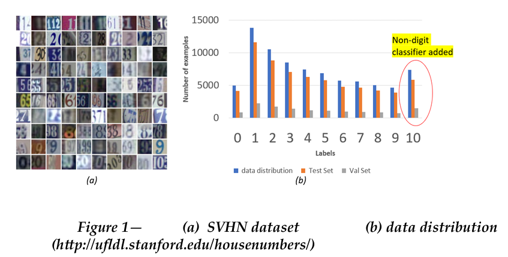

# Computer Vision Projects

This page covers some of my computer vision projects. The code for these projects is in a private repo which is available upon request.

## A) Compression and Filtering 
Compression is the way to reduce the size of an image by reducing information in the image by only selecting the frequencies which have a
higher contribution for a given image, based on a threshold value. Only the amplitudes (magnitude) greater than the threshold will be
retained in the complex plane.
With higher compression, the threshold is higher. This means only a handful of frequencies will be picked and a lot of information may be
lost. The image will loose most of the details. The dog images below show that.

   
  <em>Figure A1: Input image Dog</em>

    
  <em>Figure A2: Compressed image and FFT (lower threshold)</em>

    
  <em>Figure A3: Compressed image and FFT (higher threshold)</em>

Filtering is the way to filter out the frequency content of an image (Low pass or high pass) irrespective of the magnitude.
When filtering with a low pass, the high frequency content is filtered out which leads to ringing . Ringing is basically ripples appearing in
the image once high frequency noise is filtered out, which contain more information about the edges in an image. As seen in the cat example,
the more high frequency content we removed, the ringing becomes more and more prominent.

   
  <em>Figure A4: Input image Cat</em>

    
  <em>Figure A5: Filtered image and low pass filter</em>

    
  <em>Figure A6: Filtered image  and low pass filter</em>

## B) Lucas Kanade

Tracking image shift - More details coming soon 

    
  <em>Figure B1:Input image 0 shift and right shift 2 units</em>

   
  <em>Figure B2: Lucas Kanade optical flow

## C) Gaussian and Laplacian Pyramid

More content coming soon

   
  <em>Figure C1: Gaussian Pyramid

   
  <em>Figure C2: Laplacian Pyramid

## D) Object detection and Tracking - Particle filters

More content coming soon

     
  <em>Figure D1: Object detection and Tracking using particle filters

## E) Face Detection

More content coming soon

     
  <em>Figure E1: Average face and Eigen faces

## F) CNN Digit classification and Detection

Convolutional Neural networks are a Deep learning architecture
 which help in image recognition, object detection and localization. When using
 just neural networks for this task, the parameter size becomes huge as each pixel
 is considered as a feature. CNNs help to make the localized pa ern in an image
 translation invariant, and this helps reduce the number of parameters
 drastically. The feature space is then proportional to the filter size and not the
 number of pixels in an image.

 For this project, SVHN dataset has been trained with VVG-16 CNN to recognize
 a sequence of digits in an image. A non digit classifier with label 10 was trained
 along with SVHN to eliminate false positives.

    
  <em>Figure F1: Augmented SVHN dataset

### METHOD and ALGORITHM
 The MSER algorithm is used for localization and digits are classified using image
 pyramid and sliding window on the localized patch. Around 50% of the
 bounding boxes returned from MSER are eliminated based on the box
 dimensions and the location in the image. If the box is at the corner of the image,
 the box is not considered. Also there is an area constraint so that very small boxes
 are not a part of classification. This reduces the number of boxes to be classified
 significantly
 A non-digit classifier with label 10, was trained along with SVHN to eliminate
 the false positives. The images were taken from the internet and from the
 examples used in the report. Around 5500, 32 x 32 examples were trained and
 data augmentation was done by adding random flips, affine transforms, noise,
 and random crop. The validation set had around 1500 examples (appendix figure
 A-1)
 The overall approach was based on a 2-step classification. The aim was to localize
 the ROI first and then run a sliding window. Even though the network was
 trained with non-digits, a few false positives with high confidence were still
 2
showing up. To counter this, a second classifier step was used to eliminate false
 positive ROIs. In the second classifier step, the high confidence probabilities were
 identified by “moving box approach”, where each bounding box was made
 bigger and perturbed by delta in up, down, left, right and diagonal directions. If
 the box was a false positive, it’s highly likely that moving box will identify a few
 regions as not a digit, whereas in case of digits, small perturbations would still
 say they are digits. This helped get the correct ROIs for the sliding window
 approach. Window was resized to 32 x 128 using image pyramids and strides of 4
 and 16 were used to accurately predict the digits. Figure 2 below shows the
 overall pipeline

 

    
  <em>Figure F2: Overall pipeline

 

    
  <em>Figure F3: Digit detection and classification on few examples

Digit classification and detection video tracking - (https://drive.google.com/file/d/13VlsIiL7V8To27km389ZbwALut2mUxDG/view?usp=drive_link)

