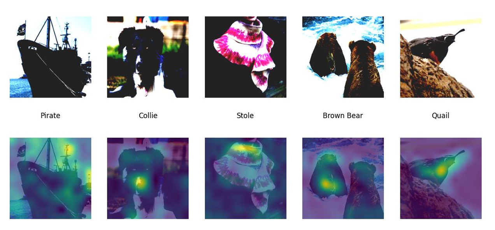
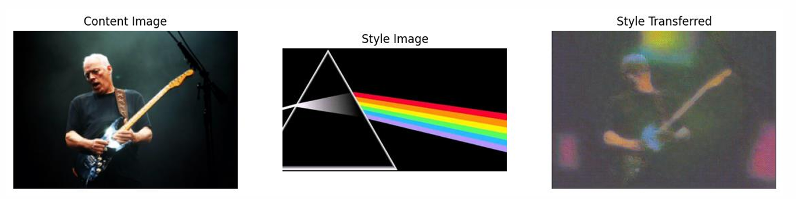

# Deep Learning Projects
This page covers some of my deep learning projects. The code for these projects is in a private repo which is available upon request.

## A) GradCam
More details coming soon

   
  <em>Figure A1: Grad Cam</em>

## B) Neural Style Transfer
More details coming soon

   
  <em>Figure A1: Grad Cam</em>

## C) Hateful memems classification 

Full report available upon request 

 This project aims to detect hateful memes, which have
 become challenging due to their multimodal nature. By ex
ploring different deep learning models and leveraging Face
book’s MMF framework, we evaluated various models be
longing to three classes. The dataset contained 10,000 mul
timodal memes labeled for hate speech. Results showed
 that the proposed models were effective, with the best
performing models achieving higher accuracy or ROC
AUC. The success of projects such as this can help filter out
 harmful content and keep the environment safe and clean.

 The experiments were split and carried out analysis (including hyper-parameter tuning) using one unimodal (Image-Grid), two multimodal with pretrained unimodal (MMBT-Grid and ViLBERT) and a multimodal with pre-trained multimodal (ViLBERT CC)

We carried out the experiments and withhyper
paramter tuning we can see the multimodal models performed better than the unimodal model.The multimodal
modal-Vilbert, during testing showed an accuracy close to 0.7,which is slightly higher than the accuracy in the paper, which is .69.Further improvements in 
cross-modal retrieval could be made to enhance the multi-modal models’ performances. While multi-modal models such as MMBT,ViLBERT,and 
ViLBERT-CC perform better than unimodal models such as ImageGrid, the improvement is not as significant as expected. This could be because the dataset contains only
 around 10,000 images. In the context of deep learning, this is a very small dataset.Using larger and more diverse datasets could lead to better cross-modal retrieval performance. However,obtaining more labeled images can be a very expensive task both time-wise and cost-wise. Also, improving the attention mechanisms and fusion methods architecturally or by further fine-tuning different combinations of hyperparameters, such as dropout rate,word and image embedding sizes, and attention parameters, could lead to an improvement in accuracy

